## Array
- 在**连续的**内存空间中，存储一组**相同的元素**：

    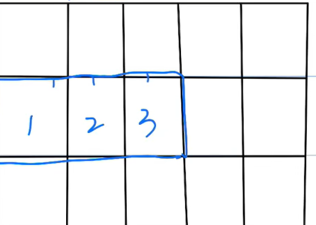

    - 时间复杂度(读非常快，写很慢)：
        - 访问：O(1)
        - 搜索(index)：O(N)
        - 插入(insert)：O(N)
        - 删除：
            - remove：O(N)
            - pop(N)指定删除某个索引：O(N)
            - pop()删除最后一个元素：O(1)
        - 添加(append)：O(1) 或者 O(N)
        - 更新：O(1)
        - 遍历数组：
            - for i in a:
            - for index, element in a:
            - for i in range(0, len(a)):
        - 排序(sort)：O(NlogN)
### 数组练习题：
#### 485
#### 283
```py
class Solution(object):
    def moveZeroes(self, nums):
        """
        :type nums: List[int]
        :rtype: None Do not return anything, modify nums in-place instead.
        """
        index = 0
        for i in nums:
            if i != 0:
                nums[index] = i
                index += 1
        
        for i in range(index, len(nums)):
            nums[i] = 0
```
#### 27
```py
class Solution(object):
    def removeElement(self, nums, val):
        """
        :type nums: List[int]
        :type val: int
        :rtype: int
        """
        i = 0
        for x in nums:
            if x != val:
                nums[i] = x
                i += 1
        return i
```


## Linked List
- 不需要再**连续的**内存空间中存储，可以在分散的内存空间中存储一组**相同的元素**：

    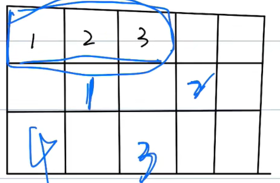

- 单端链表
- 时间复杂度(写非常快，读很慢)：
        - 访问：O(N)
        - 搜索(index)：O(N)
        - 插入(insert)：O(1)
        - 删除：O(1)

> 双端链表：就是多了一个preview

### 链表练习题：
#### 203：移除链表元素
```py
# Definition for singly-linked list.
class ListNode(object):
    def __init__(self, val=0, next=None):
        self.val = val
        self.next = next
class Solution(object):
    def removeElements(self, head, val):
        """
        :type head: Optional[ListNode]
        :type val: int
        :rtype: Optional[ListNode]
        """
        dummy_head = ListNode(-1)
        dummy_head.next = head
        
        current_node = dummy_head
        while current_node.next != None:
            if current_node.next.val == val:
                current_node.next = current_node.next.next
            else:
                current_node = current_node.next
                
        return dummy_head.next
```
#### 206：反转链表
```py
# Definition for singly-linked list.
class ListNode(object):
    def __init__(self, val=0, next=None):
        self.val = val
        self.next = next
class Solution(object):
    def reverseList(self, head):
        """
        :type head: Optional[ListNode]
        :rtype: Optional[ListNode]
        """
        current = head
        prev = None
        while current.next != None:
            nextNode = current.next
            current.next = prev
            prev = current
            current = nextNode
        return prev
```

## Queue(先进先出)
- 时间复杂度(写非常快，读很慢)：
        - 访问：O(N)
        - 搜索：O(N)
        - 插入：O(1)
        - 删除：O(1)

### 队列练习题：
#### 993：最近请求次数
```py
class RecentCounter(object):

    def __init__(self):
        self.q = deque()

    def ping(self, t):
        """
        :type t: int
        :rtype: int
        """
        result = 0
        self.q.append(t)
        while len(self.q) > 0 and t - self.q[0] > 3000:
            self.q.popleft()
        return len(self.q)
```


## stack(先进后出)
- 创建：stack = []
- 时间复杂度：
    - 访问：O(1)
    - 搜索(stack[-1])：O(1)
    - 插入(insert)：O(1)
    - 删除(pop())：O(1)
    - 添加(append)：O(1)
    - 更新：O(1)
    - 遍历：
        - while len(stack) > 0:
            temp = stack.pop()
            print(temp)
### 栈练习题：
#### 20 有效括号
```py
class Solution(object):
    def isValid(self, s):
        """
        :type s: str
        :rtype: bool
        """
        stack = []

        for char in s:
            if char == '(' or char == '{' or char == '[':
                stack.append(char)
            elif not stack:
                return False
            else:
                if char == ')':
                    if stack.pop() != '(':
                        return False
                if char == '}':
                    if stack.pop() != '{':
                        return False
                if char == ']':
                    if stack.pop() != '[':
                        return False
        return not stack
```
#### 496
```py
class Solution(object):
    def nextGreaterElement(self, nums1, nums2):
        """
        :type nums1: List[int]
        :type nums2: List[int]
        :rtype: List[int]
        """
        output = []
        stack = []
        for num in nums2:
            stack.append(num)

        for num in nums1:
            temp = []
            result = False
            max = -1
            while result != True:
                top = stack.pop()
                if top > num:
                    max = top
                elif top == num:
                    result = True
                temp.append(top)
            output.append(max)
            while len(temp) != 0:
                stack.append(temp.pop())
        return output
```
单栈版本：
```py
class Solution(object):
    def nextGreaterElement(self, nums1, nums2):
        stack = []
        next_greater = {}  # map number -> next greater

        for num in nums2:
            while stack and num > stack[-1]:
                prev = stack.pop()
                next_greater[prev] = num
            stack.append(num)

        # Remaining elements have no next greater
        for num in stack:
            next_greater[num] = -1

        # Build result for nums1
        return [next_greater[num] for num in nums1]
```


## 哈希表(Hash Table)
- 如果哈希碰撞，有两个key指向一个内存地址：
    - 可以通过创建一个链表解决：
        
        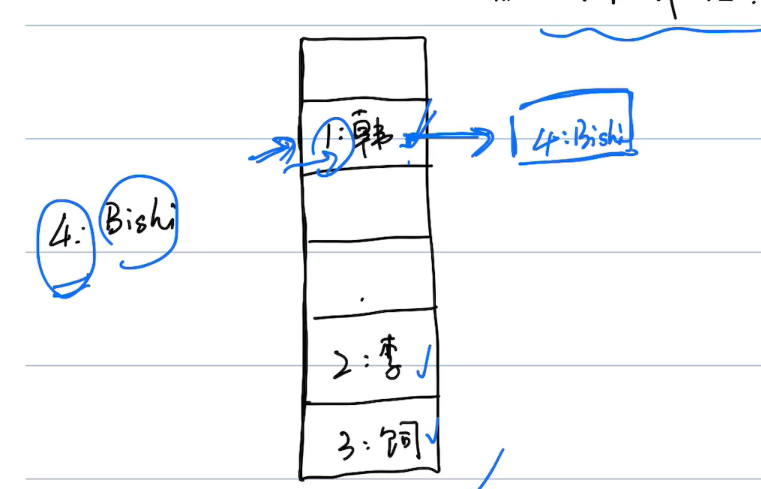

- 创建：
    - 通过数组创建：hashtable = ['']*4
    - 通过字典创建：mapping = {}
- 时间复杂度：
    - 访问：X(没有索引的概念，所以不存在访问)
    - 搜索：O(1) (直接通过哈希函数，定位到key的内存地址)：
        - 数组：hashtable[1]
        - 字典：mapping[1]
    - 插入()：O(1)
    - 删除()：O(1)
    - 添加元素：O(1)
        - 数组：hashtable[1] = 'ray'
        - 字典：mapping[1] = 'ray'
    - 更新元素：O(1)
        - 数组：hashtable[1] = 'ray'
        - 字典：mapping[1] = 'ray'
    - 删除：O(1)
        - 数组：hashtable[1] = ''
        - 字典：mapping.pop(1) / del mapping[1]
    - 检查key是否存在：O(1): 3 in mapping
    - 长度O(1)：len(mapping)

### 哈希表练习题：
#### 217检查是否有重复的数字

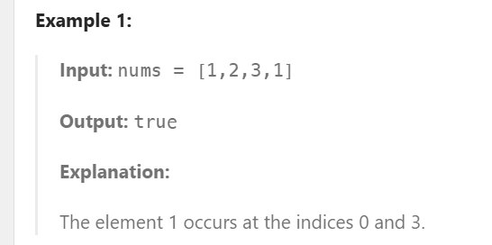

```py
class Solution(object):
    def containsDuplicate(self, nums):
        """
        :type nums: List[int]
        :rtype: bool
        """
        result = {}
        for num in nums:
            if num not in result:
                result[num] = 1
            else:
                count = result[num]
                result[num] = count + 1
    
        for value in result.values():
            if value > 1:
                return True
        return False 
```

```py
#更优雅的dict解法
class Solution(object):
    def containsDuplicate(self, nums):
        seen = {}  # 用字典记录已经出现过的元素
        for num in nums:
            if num in seen:   # 如果已经出现过
                return True   # 立即返回 True（发现重复）
            seen[num] = 1     # 否则加入字典
        return False          # 遍历完毕没发现重复，返回 False
```
#### 389 找不同

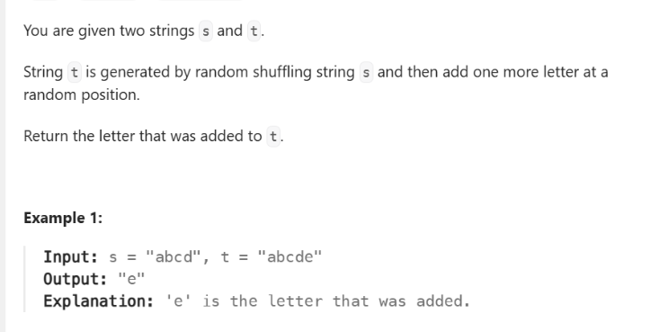

```py
class Solution(object):
    def findTheDifference(self, s, t):
        """
        :type s: str
        :type t: str
        :rtype: str
        """
        result = {}
        result2 = {}
        for char in s:
            if char not in result:
                result[char] = 1
            else:
                count = result[char]
                result[char] = count + 1
        
        for char in t:
            if char not in result2:
                result2[char] = 1
            else:
                count = result2[char]
                result2[char] = count + 1
        
        for key, value in result2.items():
            if key not in result:
                return key
            if value != result[key]:
                return key
```
```py
# 更优雅的解法
class Solution(object):
    def findTheDifference(self, s, t):
        count = {}

        # 统计 s 中每个字符
        for char in s:
            count[char] = count.get(char, 0) + 1

        # 遍历 t，逐个消耗
        for char in t:
            if char not in count or count[char] == 0:
                return char
            count[char] -= 1
```
#### 496 找下一个更大的数字

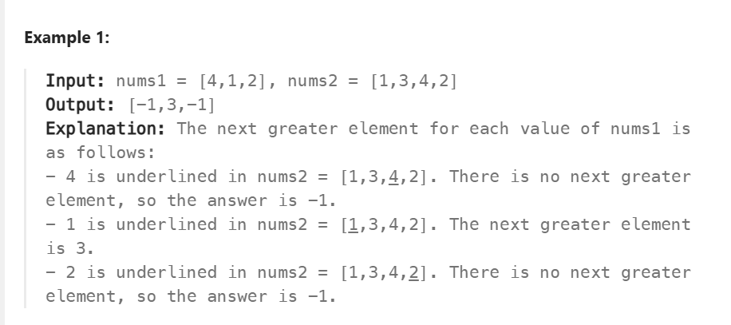

```py
class Solution(object):
    def nextGreaterElement(self, nums1, nums2):
        """
        :type nums1: List[int]
        :type nums2: List[int]
        :rtype: List[int]
        """
        output = []
        stack = []
        for num in nums2:
            stack.append(num)

        for num in nums1:
            temp = []
            result = False
            max = -1
            while result != True:
                top = stack.pop()
                if top > num:
                    max = top
                elif top == num:
                    result = True
                temp.append(top)
            output.append(max)
            while len(temp) != 0:
                stack.append(temp.pop())
        return output
```

```py
# 更好的方法
class Solution(object):
    def nextGreaterElement(self, nums1, nums2):
        stack = []
        next_greater = {}

        # 遍历 nums2，用单调栈找每个元素的下一个更大元素
        for num in nums2:
            while stack and num > stack[-1]:
                prev = stack.pop()
                next_greater[prev] = num
            stack.append(num)

        # 栈里剩下的元素没有更大值，映射为 -1
        for num in stack:
            next_greater[num] = -1

        # 在 nums1 中直接查 dict
        return [next_greater[num] for num in nums1]
```

## 集合(set)
- 不重复，但不保证顺序的数组
- 创建：s = set()
- 时间复杂度：
    - 访问：X(没有索引的概念，所以不存在访问)
    - 搜索O(1)：2 in s
        - O(1) (直接通过哈希函数，定位到key的内存地址)
        - O(K)（有哈希冲突）
    - 添加(s.add(5))：不保证顺序
        - O(1)
        - O(K)（有哈希冲突）
    - 删除(s.remove(2))：
        - O(1)
        - O(K)（有哈希冲突）
    - 长度O(1)：len(s)

### set练习题：
#### 217检查是否有重复的数字
```py
#我自己的解法
class Solution(object):
    def containsDuplicate(self, nums):
        """
        :type nums: List[int]
        :rtype: bool
        """
        s = set()
        for num in nums:
            s.add(num)
        return (len(nums) != len(s))
        # 更优雅的写法,一行搞定
        # return len(nums) != len(set(nums))
```

```py
# 最高效的解法，时间复杂度有可能为0(1)
class Solution(object):
    def containsDuplicate(self, nums):
        s=set()
        for n in nums:
            if n in s:
                return True
            s.add(n)
        return False
```
#### 705
```py
class MyHashSet(object):

    def __init__(self):
        self.data = [False] * 1000001

    def add(self, key):
        """
        :type key: int
        :rtype: None
        """
        self.data[key] = True

    def remove(self, key):
        """
        :type key: int
        :rtype: None
        """
        self.data[key] = False

    def contains(self, key):
        """
        :type key: int
        :rtype: bool
        """
        return self.data[key]
```

## 树(tree)
- 节点：
    - 根节点，最上面的节点
    - 叶子节点，没有子节点的末尾节点
- 高度，深度和层的感念：

    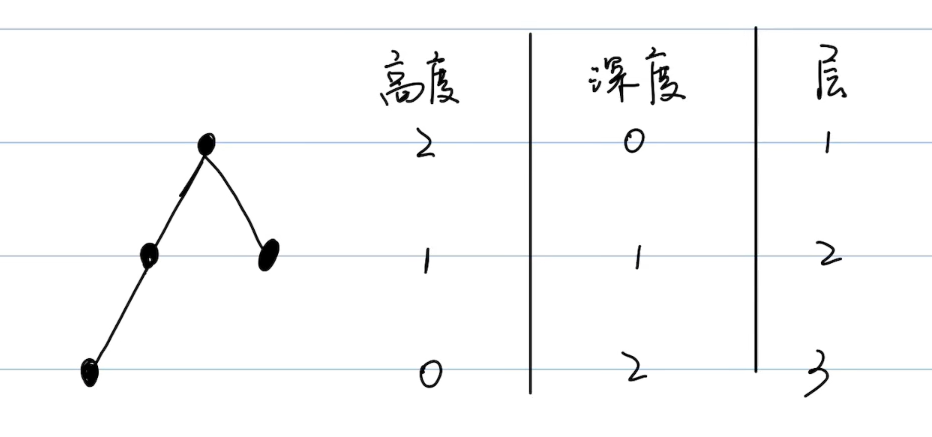

- 二叉树：每个节点最多有两个子节点，不能超过两个。
    - 满二叉树：除了叶子节点，所有节点都有两个字节点，所有叶子节点必须在同一层
    - 完全二叉树：从上到下，从左到右依次填满节点形成的二叉树

- 前序遍历：根→左→右

    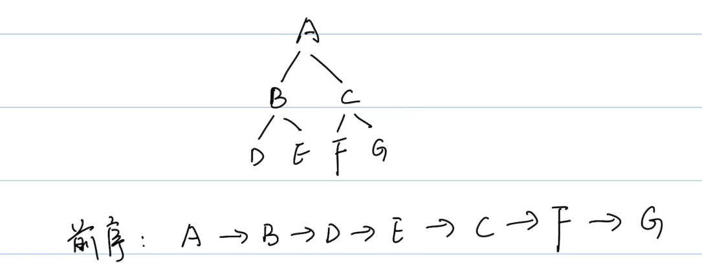

- 中序遍历：左→根→右

    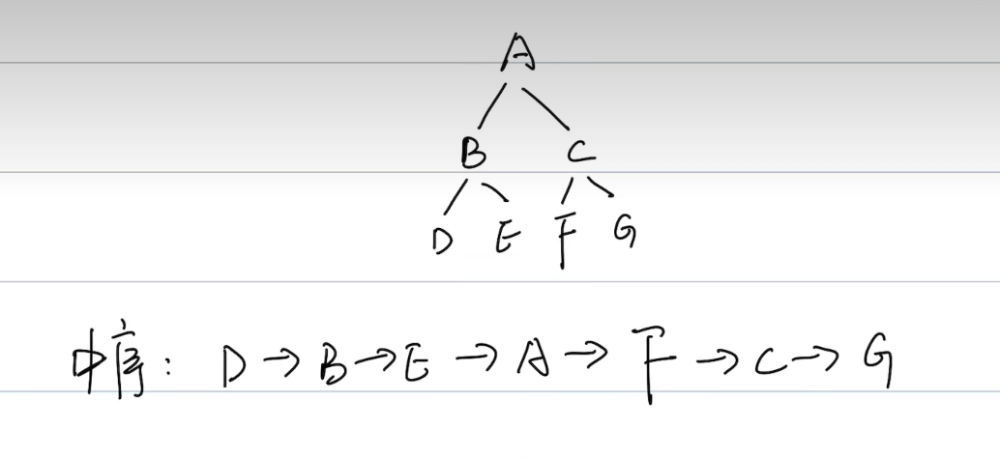

- 后序遍历：左→右→根

    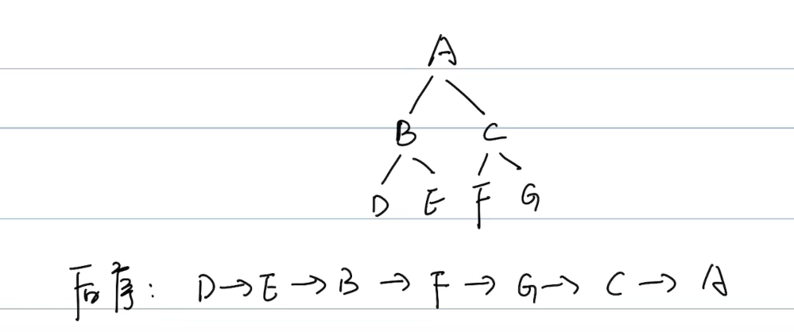

### tree练习题：
#### 144 二叉树前序遍历(根→左→右)
```py
class Solution(object):
    def preorderTraversal(self, root):
        """
        :type root: Optional[TreeNode]
        :rtype: List[int]
        """
        if not root:
            return []
        result, stack = [], [root]
        while stack:
            node = stack.pop()
            result.append(node.val)       # 先访问根
            if node.right:                # 注意：先 push 右
                stack.append(node.right)
            if node.left:                 # 再 push 左
                stack.append(node.left)
        return result
```

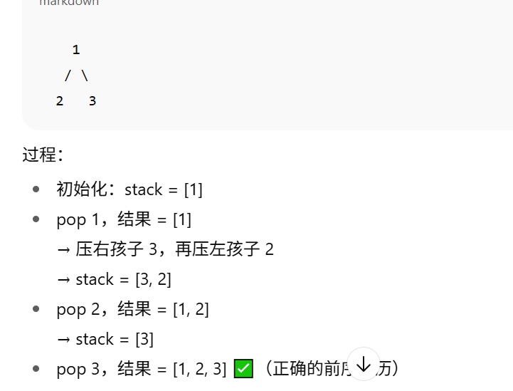

#### 94 二叉树中序遍历(左根右)
```py
class Solution(object):
    def inorderTraversal(self, root):
        """
        :type root: Optional[TreeNode]
        :rtype: List[int]
        """
        result, stack = [], []
        curr = root
        while curr or stack:
            # 1. 一直走到最左边，把沿途节点都压栈
            while curr:
                stack.append(curr)
                curr = curr.left
            # 2. 到达最左边后，弹出栈顶节点
            curr = stack.pop()
            result.append(curr.val)  # 访问根节点
            # 3. 转向右子树
            curr = curr.right
```

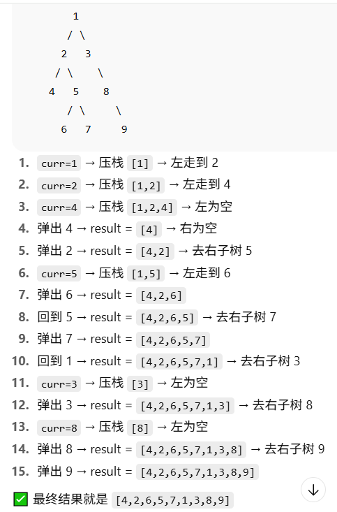

#### 145 二叉树后序遍历(左右根)
```py
class Solution(object):
    def postorderTraversal(self, root):
        """
        :type root: Optional[TreeNode]
        :rtype: List[int]
        """
        result, stack = [], []
        prev = None
        curr = root
        while curr or stack:
            while curr:
                stack.append(curr)
                curr = curr.left
            node = stack[-1]
            if not node.right or node.right == prev:  #最终回到主节点时，确保不会重复访问右子节点，所以需要有一个prev表示已经访问过了
                result.append(node.val)
                stack.pop()
                prev = node
            else:
                curr = node.right
        return result
```

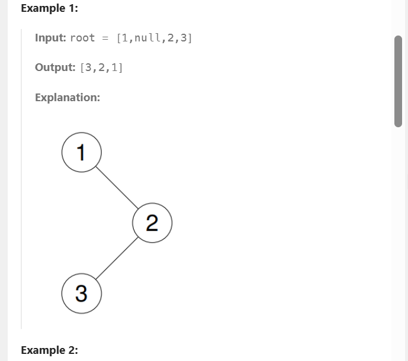

## 堆(heap)
- 完全二叉树
- 每个节点都要 >= 或者 <= 孩子节点
    - 所有节点都大于或等于孩子节点，称为最大堆
    - 所有节点都小于或等于孩子节点，称为最小堆
    > 左边是最大堆，右边是最小堆

    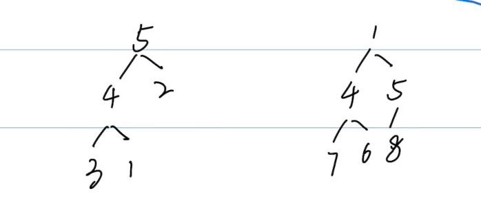

- 创建堆：
> python无法直接创建一个最大堆，所以需要将当前列表所有的数变成负数，然后转换成一个最小堆，然后再每个数乘以负一得到最大堆
```py
import heapq
# 创建一个列表
minheap = []
# 使用heapq将一个列表变成堆
heapq.heapify(minheap)
```
- 添加element：
```py
heapq.heappush(minheap, 10);
```
- 时间复杂度：
    - 搜索(一般只查看堆顶)：O(1)
    ```minheap[0]```
    - 添加Insert：O(logN)
    - 删除delete：O(logN)
    ```heapq.heappop(minheap)```
    - 长度：```len(minheap)```
    - 遍历：
    ```py
    while minheap:
        print(heapq.heappop(minheap))
    ```

### 堆练习题：
#### 215
#### 692