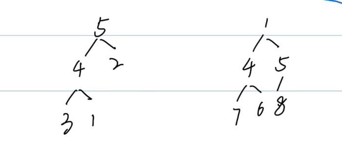
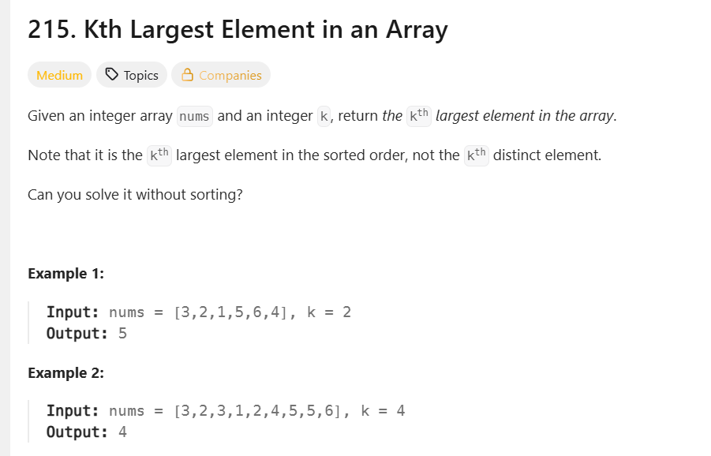
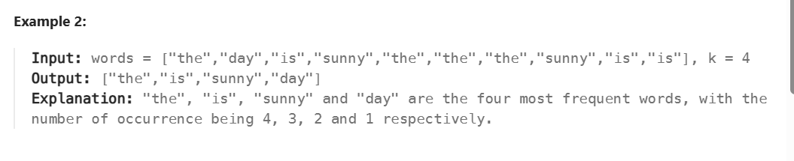

## 堆(heap)
- 完全二叉树
- 每个节点都要 >= 或者 <= 孩子节点
    - 所有节点都大于或等于孩子节点，称为最大堆
    - 所有节点都小于或等于孩子节点，称为最小堆
    > 左边是最大堆，右边是最小堆

    

- 创建堆：
> python无法直接创建一个最大堆，所以需要将当前列表所有的数变成负数，然后转换成一个最小堆，然后再每个数乘以负一得到最大堆
```py
import heapq
# 创建一个列表
minheap = []
# 使用heapq将一个列表变成堆O(n)
heapq.heapify(minheap)
```
- 添加element：
```py
heapq.heappush(minheap, 10)
```
- 时间复杂度：
    - 搜索(一般只查看堆顶)：O(1)
    ```minheap[0]```
    - 添加Insert：O(logN)
    - 删除delete：O(logN)
    ```heapq.heappop(minheap)```
    - 长度：```len(minheap)```
    - 遍历：
    ```py
    while minheap:
        print(heapq.heappop(minheap))
    ```

### 堆练习题：
#### 215查找数组中第X大的数字



```py
class Solution(object):
    def findKthLargest(self, nums, k):
        """
        :type nums: List[int]
        :type k: int
        :rtype: int
        """
        maxheap = [-n for n in nums]
        heapq.heapify(maxheap)
        for _ in range(k - 1):
            heapq.heappop(maxheap)
        return -heapq.heappop(maxheap)
```
#### 692 找出现频率从高到低的K个元素



复杂度为(O(N+kLogN))
```py
class Solution(object):
    def topKFrequent(self, words, k):
        """
        :type words: List[str]
        :type k: int
        :rtype: List[str]
        """
        freq, result = {}, []
        for word in words:
            freq[word] = freq.get(word, 0) - 1
        
        heap = [(count, word) for word, count in freq.items()]
        heapq.heapify(heap)
        for _ in range(k):
            result.append(heapq.heappop(heap)[1])
        return result
```

复杂度为O(n log k)
```py
# 更高效的写法
class Solution(object):
    def topKFrequent(self, words, k):
        freq = {}
        for word in words:
            freq[word] = freq.get(word, 0) + 1

        heap = []
        for word, count in freq.items():
            # 先存频率，再存单词（字典序反向，为了保持排序正确）
            heapq.heappush(heap, (count, -ord(word[0]), word))
            if len(heap) > k:
                heapq.heappop(heap)

        # 最小堆得到的是升序，需要反转
        return [w for _, _, w in sorted(heap, key=lambda x: (-x[0], x[2]))]
```