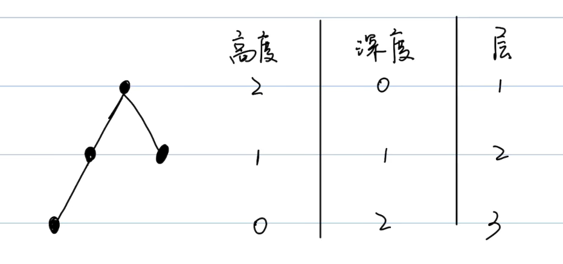
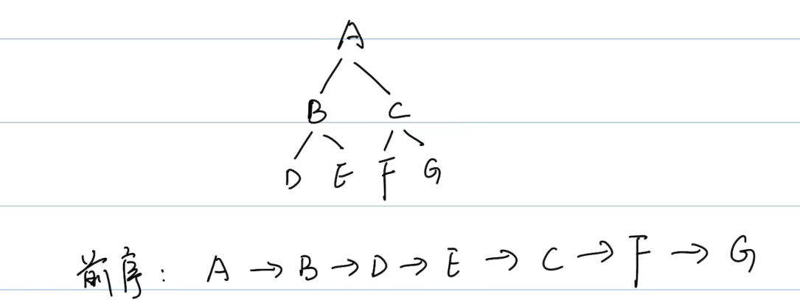
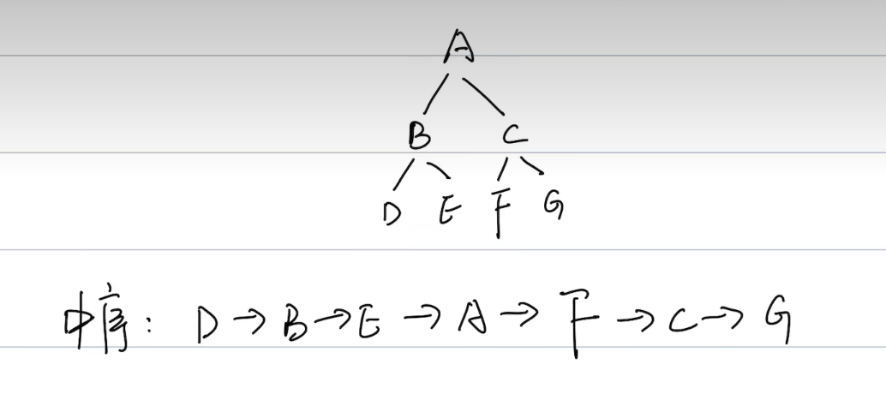
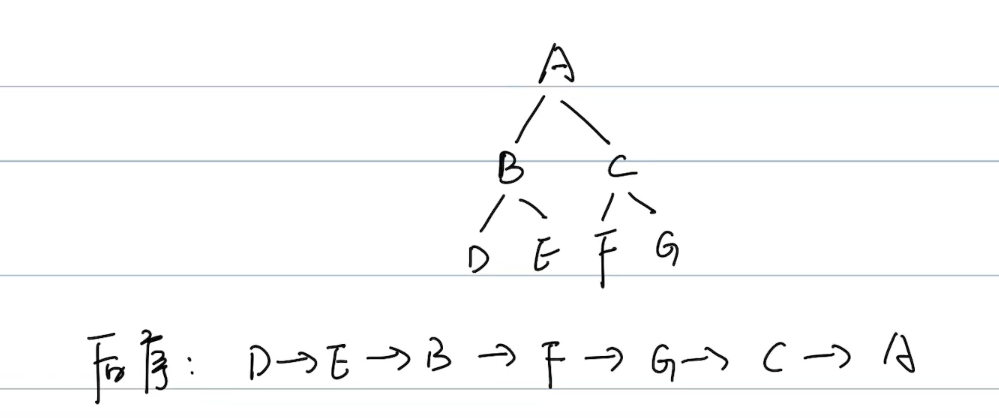
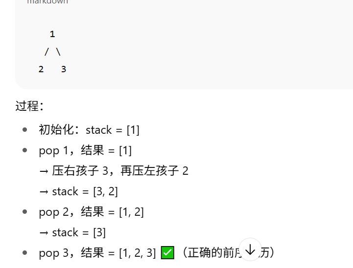
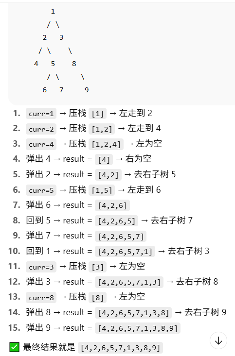
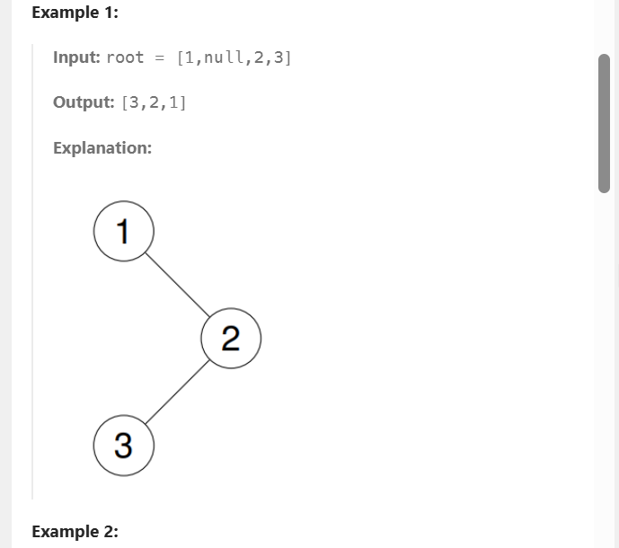

## 树(tree)
- 节点：
    - 根节点，最上面的节点
    - 叶子节点，没有子节点的末尾节点
- 高度，深度和层的感念：

    

- 二叉树：每个节点最多有两个子节点，不能超过两个。
    - 满二叉树：除了叶子节点，所有节点都有两个子节点，所有叶子节点必须在同一层
    - 完全二叉树：从上到下，从左到右依次填满节点形成的二叉树，最后一层叶子都向左对齐，且只有最后两层有叶子节点。

- 前序遍历：根→左→右

    

- 中序遍历：左→根→右

    

- 后序遍历：左→右→根

    

### tree练习题：
#### 144 二叉树前序遍历(根→左→右)
```py
class Solution(object):
    def preorderTraversal(self, root):
        """
        :type root: Optional[TreeNode]
        :rtype: List[int]
        """
        if not root:
            return []
        result, stack = [], [root]
        while stack:
            node = stack.pop()
            result.append(node.val)       # 先访问根
            if node.right:                # 注意：先 push 右
                stack.append(node.right)
            if node.left:                 # 再 push 左
                stack.append(node.left)
        return result
```



#### 94 二叉树中序遍历(左根右)
```py
class Solution(object):
    def inorderTraversal(self, root):
        """
        :type root: Optional[TreeNode]
        :rtype: List[int]
        """
        result, stack = [], []
        curr = root
        while curr or stack:
            # 1. 一直走到最左边，把沿途节点都压栈
            while curr:
                stack.append(curr)
                curr = curr.left
            # 2. 到达最左边后，弹出栈顶节点
            curr = stack.pop()
            result.append(curr.val)  # 访问根节点
            # 3. 转向右子树
            curr = curr.right
```



#### 145 二叉树后序遍历(左右根)
```py
class Solution(object):
    def postorderTraversal(self, root):
        """
        :type root: Optional[TreeNode]
        :rtype: List[int]
        """
        result, stack = [], []
        prev = None
        curr = root
        while curr or stack:
            while curr:
                stack.append(curr)
                curr = curr.left
            node = stack[-1]
            if not node.right or node.right == prev:  #最终回到主节点时，确保不会重复访问右子节点，所以需要有一个prev表示已经访问过了
                result.append(node.val)
                stack.pop()
                prev = node
            else:
                curr = node.right
        return result
```

