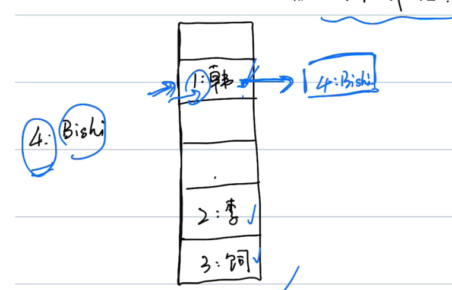
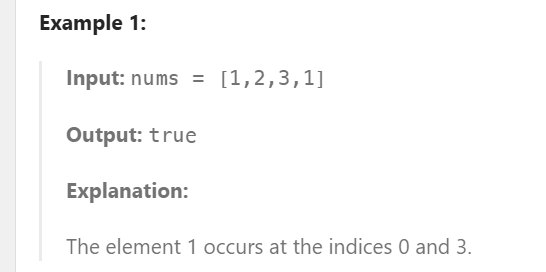
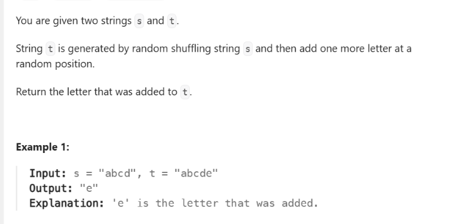
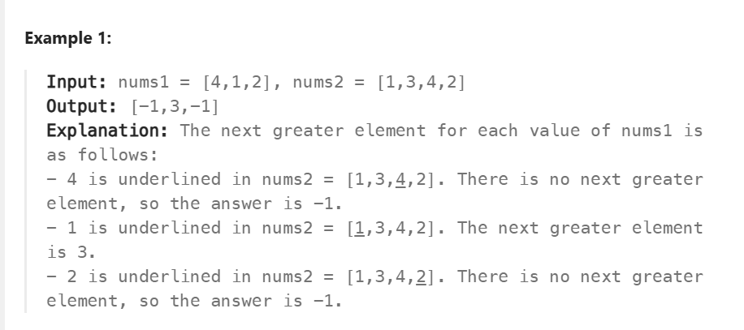

## 哈希表(Hash Table)
- 如果哈希碰撞，有两个key指向一个内存地址：
    - 可以通过创建一个链表解决：
        
        

- 创建**O(1)**：
    - 通过数组创建：```hashtable = ['']*4```
    - 通过字典创建：```mapping = {}```
- 时间复杂度：
    - 访问：X(没有索引的概念，所以不存在访问)
    - 搜索：**O(1)，有哈希碰撞O(N)** (直接通过哈希函数，定位到key的内存地址)：
        - 数组：```hashtable[1]```
        - 字典：```mapping[1]```
    - 插入**O(1)，有哈希碰撞O(N)**：```mapping["c"] = 3```
    - 删除**O(1)，有哈希碰撞O(N)**：
        ```py
        pop("a") 
        del mapping["a"]
        ```
    - 更新元素**O(1)，有哈希碰撞O(N)**:
        - 数组：```hashtable[1] = 'ray'```
        - 字典：```mapping[1] = 'ray'```
    - 检查key是否存在**O(1)，有哈希碰撞O(N)**: ```3 in mapping```
    - 长度**O(1)**：```len(mapping)```

### 哈希表练习题：
#### 217检查是否有重复的数字



```py
class Solution(object):
    def containsDuplicate(self, nums):
        """
        :type nums: List[int]
        :rtype: bool
        """
        result = {}
        for num in nums:
            if num not in result:
                result[num] = 1
            else:
                count = result[num]
                result[num] = count + 1
    
        for value in result.values():
            if value > 1:
                return True
        return False 
```

```py
#更优雅的dict解法
class Solution(object):
    def containsDuplicate(self, nums):
        seen = {}  # 用字典记录已经出现过的元素
        for num in nums:
            if num in seen:   # 如果已经出现过
                return True   # 立即返回 True（发现重复）
            seen[num] = 1     # 否则加入字典
        return False          # 遍历完毕没发现重复，返回 False
```
#### 389 找不同



```py
class Solution(object):
    def findTheDifference(self, s, t):
        """
        :type s: str
        :type t: str
        :rtype: str
        """
        result = {}
        result2 = {}
        for char in s: 
            if char not in result:
                result[char] = 1
            else:
                count = result[char]
                result[char] = count + 1
        
        for char in t:
            if char not in result2:
                result2[char] = 1
            else:
                count = result2[char]
                result2[char] = count + 1
        
        for key, value in result2.items():
            if key not in result:
                return key
            if value != result[key]:
                return key
```
```py
# 更优雅的解法
class Solution(object):
    def findTheDifference(self, s, t):
        count = {}

        # 统计 s 中每个字符
        for char in s:
            count[char] = count.get(char, 0) + 1

        # 遍历 t，逐个消耗
        for char in t:
            if char not in count or count[char] == 0:
                return char
            count[char] -= 1
```
#### 496 找下一个更大的数字



```py
class Solution(object):
    def nextGreaterElement(self, nums1, nums2):
        """
        :type nums1: List[int]
        :type nums2: List[int]
        :rtype: List[int]
        """
        output = []
        stack = []
        for num in nums2:
            stack.append(num)

        for num in nums1:
            temp = []
            result = False
            max = -1
            while result != True:
                top = stack.pop()
                if top > num:
                    max = top
                elif top == num:
                    result = True
                temp.append(top)
            output.append(max)
            while len(temp) != 0:
                stack.append(temp.pop())
        return output
```

```py
# 更好的方法
class Solution(object):
    def nextGreaterElement(self, nums1, nums2):
        stack = []
        next_greater = {}

        # 遍历 nums2，用单调栈找每个元素的下一个更大元素
        for num in nums2:
            while stack and num > stack[-1]:
                prev = stack.pop()
                next_greater[prev] = num
            stack.append(num)

        # 栈里剩下的元素没有更大值，映射为 -1
        for num in stack:
            next_greater[num] = -1

        # 在 nums1 中直接查 dict
        return [next_greater[num] for num in nums1]
```