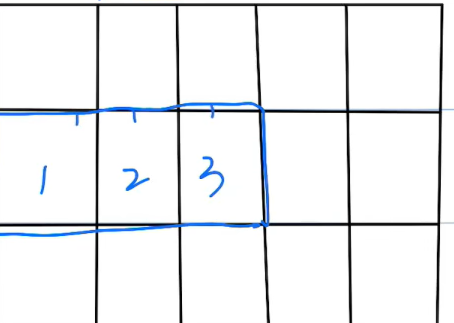

## Array
- 在**连续的**内存空间中，存储一组**相同的元素**：

    

    - 时间复杂度(**读非常快，写很慢**)：
        - 访问(**list[2]**)：O(1)
        - 搜索(**list.index(ray)**)：O(N)
        - 插入(**list.insert(2, 99)**)：O(N)
        - 删除：
            - **list.remove(30)**：O(N)
            - **list.pop(30)**指定删除某个索引：O(N)
            - **list.pop()**删除最后一个元素：O(1)
        - 添加：O(1) 或者 O(N):
            - **list.append(40)**
            - **list.extend([3, 4])**
        - 更新(**list[2] = 1**)：O(1)
        - 遍历数组：O(N)
            - **for i in a**:
            - **for index, element in a**:
            - **for i in range(0, len(a))**:
        - 排序(**list.sort()**)：O(NlogN)
    
### 数组练习题：
#### 485
#### 283
```py
class Solution(object):
    def moveZeroes(self, nums):
        """
        :type nums: List[int]
        :rtype: None Do not return anything, modify nums in-place instead.
        """
        index = 0
        for i in nums:
            if i != 0:
                nums[index] = i
                index += 1
        
        for i in range(index, len(nums)):
            nums[i] = 0
```
#### 27
```py
class Solution(object):
    def removeElement(self, nums, val):
        """
        :type nums: List[int]
        :type val: int
        :rtype: int
        """
        i = 0
        for x in nums:
            if x != val:
                nums[i] = x
                i += 1
        return i
```