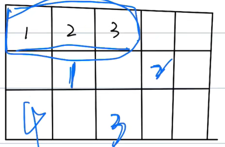

## Linked List
- 不需要再**连续的**内存空间中存储，可以在分散的内存空间中存储一组**相同的元素**：

    

- 单端链表
- 时间复杂度(写非常快，读很慢)：
    - 访问O(N)：必须从头开始遍历，循环```cur.next```直到找到需要访问的值
    - 搜索**O(N)**：必须从头开始遍历，然后对比```cur == target```
    - 插入**O(1)/O(N)**：
        ```py
        newnode.next = cur.next 
        cur.next=newnode
        ```
    - 删除**O(1)/O(N)**：```cur.next = cur.next.next```
    - 添加**O(1)/O(N)**：node.next = head
    - 更新**O(1)/O(N)**：**cur.val = 123**
    - 遍历数组**O(N)**：  
        ```py
        cur = head
        while cur:
        print(cur.val)
        cur = cur.next
        ```

> 双端链表：就是多了一个preview

### 链表练习题：
#### 203：移除链表元素
```py
# Definition for singly-linked list.
class ListNode(object):
    def __init__(self, val=0, next=None):
        self.val = val
        self.next = next
class Solution(object):
    def removeElements(self, head, val):
        """
        :type head: Optional[ListNode]
        :type val: int
        :rtype: Optional[ListNode]
        """
        dummy_head = ListNode(-1)
        dummy_head.next = head
        
        current_node = dummy_head
        while current_node.next != None:
            if current_node.next.val == val:
                current_node.next = current_node.next.next
            else:
                current_node = current_node.next
                
        return dummy_head.next
```
#### 206：反转链表
```py
# Definition for singly-linked list.
class ListNode(object):
    def __init__(self, val=0, next=None):
        self.val = val
        self.next = next
class Solution(object):
    def reverseList(self, head):
        """
        :type head: Optional[ListNode]
        :rtype: Optional[ListNode]
        """
        current = head
        prev = None
        while current.next != None:
            nextNode = current.next
            current.next = prev
            prev = current
            current = nextNode
        return prev
```