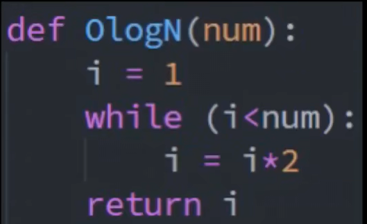
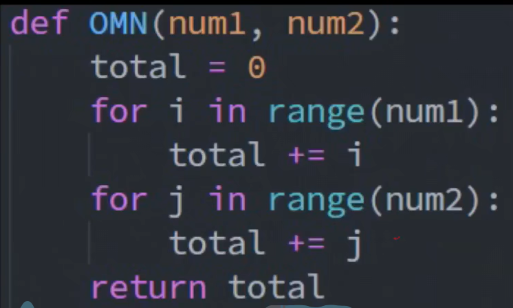
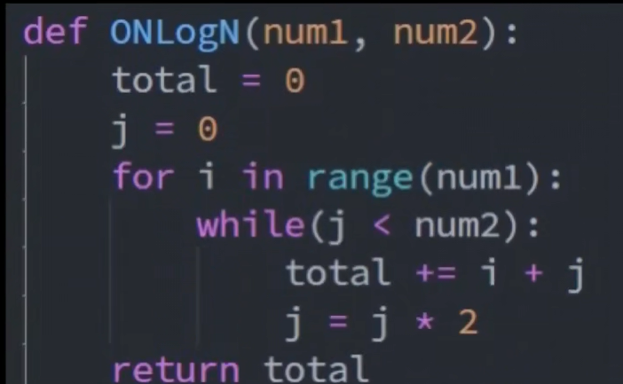
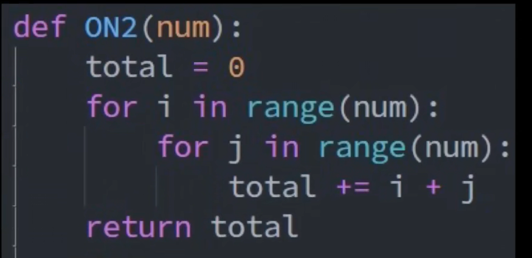
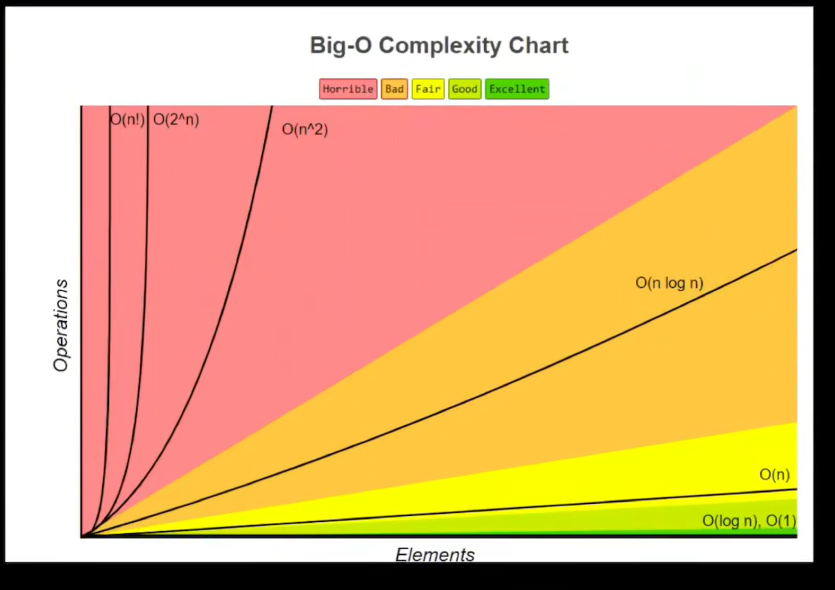
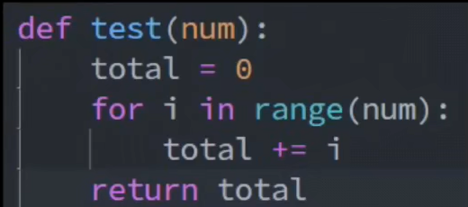
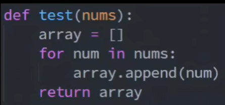
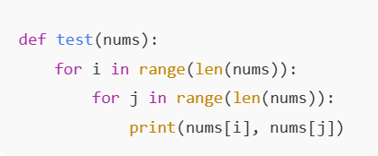

## 时间复杂度
- 执行时间和输入值的关系
    - O(N)
    
        比如典型的for循环语句，因为中间循环要执行的循环是根据这个num大小而定的，所以num是多少就要执行N次，就是O(N)：
    ```py
    def test(num):
        total=0
        for i in range(num):
            total+=i
        return total
    ```

    - O(1)：

        表示算法执行时间，就是不管输入值num有多大，它就只会执行一次,一般没有循环都是O(1)：

        ```py
         def test(num):
        i = num
        i = num*2
        return i+j
        ```
    - O(log n)：

        因为每次都是让i翻倍，相当于就是2^k >= num时退出，转换过来就是k>=log2(num)，那也就是O(logN)。

        

    - O(M+N):

        相当于有两个O(N)执行的，所以就直接相加：

        

    - O(NlogN):
        相当于是O(N)乘以O(logN)：

        

    - O(N^2):
        相当于O(N)*O(N)：

        

- Big-O Complexity Chart:



> O(1) > O(logN) > O(N) > O(NlogN) > O(N^2) > O(2^N) > O(N!)
一般斐波那契数列的递归就是O(2^N)

## 空间复杂度
- 存储空间与输入值的关系
    - O(1)
    因为只生成了一个int值total，所以只占1个存储空间：

    

    - O(N)
    因为会生成一个list，并且list的值等于这个输入num值，所以是O(N):

    
    
    - O(N^2)
    因为外层执行了N次，内层也执行了N次，所以对数组是两两组合：

    

O(1) > O(N) > O(N^2)

## 怎么选
其实很多时候只能选其一，时间和空间只能占一个，实际上都会选择时间复杂度最低的。